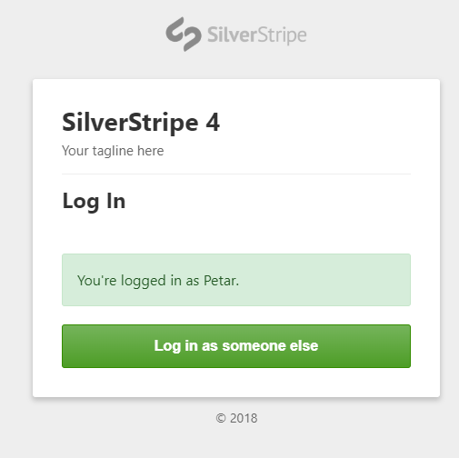

# SilverStripe security layouts
[](https://packagist.org/packages/fractas/security-layouts)
[](https://packagist.org/packages/fractas/security-layouts)
[](https://packagist.org/packages/fractas/security-layouts)
[](https://packagist.org/packages/fractas/security-layouts)

## Overview
SilverStripe module for fancier security layouts _(login, logout, lost password etc.)_ see [Screenshoots](#screenshoots) to see how they look.
Inspired by Bootstrap 4.


## Note
This module overwrites couple of _SilverStripe FormField templates_ in order to style checkbox and input fields. 


## Requirements
- SilverStripe CMS 4+
- SilverStripe Framework 4+


## Installation & Usage
- Install via Composer
  ```
  composer require "fractas/security-layouts" "2.0.x-dev"
  ```
- Add to your config.yml file:
  ```yml
   Fractas\SecurityForm\SecurityFormController:
     company_logo: 'path/to/logo.svg' # path to project or company logo, if not specified defaults to logo.png (SilverStripe logo)
     company_name: 'ACME' # name of company or project, if not specified defaults to SiteConfig Title
     company_link: 'http://www.example.com' # project or company link, if not specified defaults to Site's BaseHref
  ```
- Run flush=all in your browser


## Screenshoots





## Bugtracker

Bugs are tracked on [github.com](https://github.com/fractaslabs/silverstripe-security-layouts/issues)


## Licence

See [Licence](LICENSE)


## Credits

- logo.png by SilverStripe.org
